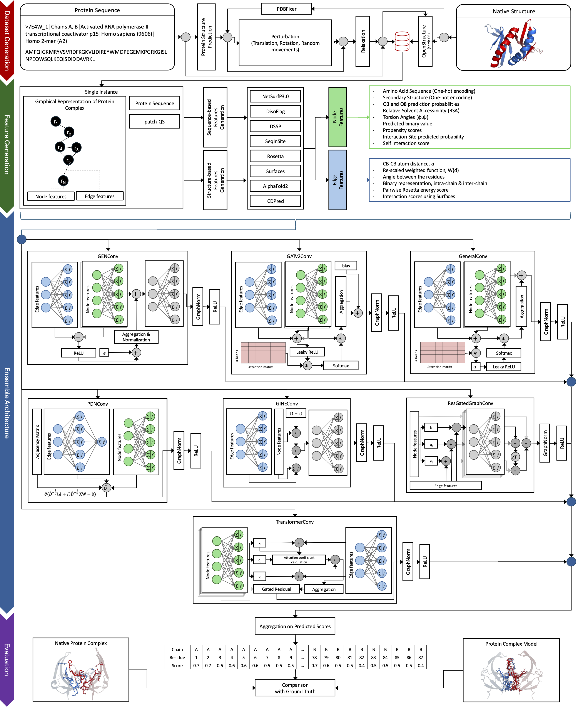

# ARC: Assessment of Interface Residue Conformation



ARC is a single-model quality assessment method for protein complexes. It uses an ensemble of graph neural networks to assign per-residue scores on modeled chain-chain interfaces, with emphasis on interface-residue identification and local interface quality.

This repository contains the inference code, CASP16 evaluation pipeline, packaged asset workflow, and manuscript figure and table generation used for the ARC study.

---

## Quick Start

The minimal workflow to reproduce ARC results:

```bash
# 1. Install environment
pixi install
pixi run smoke

# 2. Fetch packaged data and predictions
pixi run python -u scripts/assets/fetch_assets.py

# 3. Run evaluation (uses packaged predictions)
pixi run eval-full
```

To run inference instead of using packaged predictions:

```bash
pixi run run-batch
pixi run eval-full
```

---

## Output Overview

ARC produces two complementary outputs per model:

- `LOCAL.json`: per-residue interface quality scores, used for residue-level evaluation and interface discrimination.
- `QSCORE.json`: global interface quality scores, used for model ranking and CASP-style evaluation.

The `ARC/` directory contains the ensemble prediction used in the manuscript, while `ARC_<suffix>/` directories correspond to individual GNN components.

---

## Installation

#### Step 1

Clone the ARC repository and enter it (all commands assume you are at the repository root):

```bash
git clone https://github.com/zwang-bioinformatics/ARC.git
cd ARC
```

#### Step 2

Create the ARC environment with `pixi` (reads `pixi.toml` in this directory):

```bash
pixi install
pixi run smoke
```

If `pixi` is not on your `PATH`, install it from https://pixi.sh/latest/installation/ or use `~/.pixi/bin/pixi`.

> [!IMPORTANT]
> All commands below are meant to be run from the repository root.

---

## Data Setup

#### Step 3

Populate the repository data layout.

You have two options:

1. **Recommended (reproducible):** download packaged assets  
2. **Manual:** prepare inputs following the required directory structure

### Option 1: Fetch packaged assets

The recommended approach is to fetch the packaged tarballs:

```bash
pixi run python -u scripts/assets/fetch_assets.py
```

This extracts each archive (Zstandard `.tar.zst`) at the repository root:

```text
arc_eval_inputs_core.tar.zst:
data/
├── raw_16/
├── casp16_ema_reference_results/
├── casp16_targets/
├── casp_model_scores.csv
├── casp16_approx_target_sizes.json
├── ema_local_scores_with_lddt_added_mdl_contacts.csv
└── target_margin_scores.csv

arc_graph_data_casp16.tar.zst:
data/
└── CASP16/
    └── <target>/
        └── <model>/
            ├── meta.json
            └── data.st

predictions_apollo.tar.zst:
outputs/
└── predictions/
    └── CASP16/
        └── <target>/
            └── APOLLO/
                └── LOCAL.json

predictions_arc.tar.zst:
outputs/
└── predictions/
    └── CASP16/
        └── <target>/
            ├── ARC/
            │   ├── LOCAL.json
            │   └── QSCORE.json
            └── ARC_<suffix>/
                ├── LOCAL.json
                └── QSCORE.json
```

The APOLLO predictions are included as a baseline for comparison during evaluation.

In `scripts/assets/fetch_assets.py`, each archive is controlled by an `ENABLE_*` flag (all default to `True`). Set a flag to `False` to skip specific downloads.

---

### Option 2: Manual data preparation

If you prepare inputs manually, mirror the following layout:

```text
data/
├── CASP16/
│   └── <target>/
│       └── <model>/
│           ├── meta.json
│           └── data.st
├── raw_16/
├── casp16_ema_reference_results/
│   └── <model>_<target>.json
├── casp16_targets/
│   └── <target>.pdb
├── casp_model_scores.csv
├── casp16_approx_target_sizes.json
├── ema_local_scores_with_lddt_added_mdl_contacts.csv
└── target_margin_scores.csv
```

For predictions, either use the packaged layouts above or run inference to populate:

```text
outputs/predictions/CASP16/
```

---

## Usage

> [!NOTE]
> Evaluation requires predictions in `outputs/predictions/`.
> - If you fetched packaged predictions, you can run evaluation directly.
> - If not, you must run inference before evaluation.

---

### Inference

Single target:

```bash
pixi run predict -- -t H1202
```

Batch over all targets:

```bash
pixi run run-batch
```

Expected input:

```text
data/CASP16/<target>/<model>/
├── meta.json
└── data.st
```

Outputs:

```text
outputs/predictions/CASP16/<target>/
├── ARC/
│   ├── LOCAL.json
│   └── QSCORE.json
├── ARC_GENConv/
├── ARC_GINEConv/
├── ARC_GLFP/
├── ARC_GeneralConv/
├── ARC_PDNConv/
├── ARC_ResGatedGraphConv/
└── ARC_TransConv/
```

The `ARC/` directory contains the ensemble prediction used in the manuscript. The `ARC_<suffix>/` directories correspond to individual GNN components.

---

### Evaluation

Run full CASP16 evaluation and manuscript outputs:

```bash
pixi run eval-full
```

---

### Manuscript Outputs

Generate figures:

```bash
pixi run manuscript-figures
```

Generate tables:

```bash
pixi run manuscript-tables
```

---

## Outputs

```text
outputs/
├── predictions/
│   └── CASP16/<target>/...
└── results/
    ├── eval/
    ├── logs/
    └── local_results/
        ├── arc_ensemble/
        ├── manuscript_figures/
        ├── manuscript_tables/
        ├── per_target_analysis/
        └── pooled_analysis/
```

---

## Citation

If you use ARC, please cite:

```bibtex
@article{shrestha2026arc,
  title={ARC: Assessment of Interface Residue Conformation using an Ensemble of Graph Neural Networks},
  author={Shrestha, Bishal and Siciliano, Andrew J. and Huang, Gabriel and Bao, Yifan and Wang, Zheng},
  journal={Proteins: Structure, Function, and Bioinformatics},
  year={2026},
  publisher={Wiley Online Library},
  status={Submitted}
}
```
